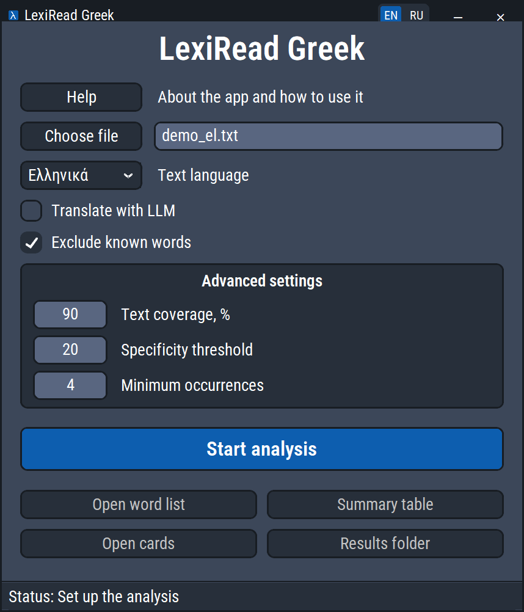

#  LexiRead Greek

*Learn by reading* — learn Greek by reading what you actually want to read.

**English** · [Русский](README.ru.md)

> **Modified version.** LexiRead Greek is an unofficial modified version of [WordByHeart](https://github.com/EgorTatarnikov/WordByHeart) by Egor Tatarnikov, extended with Modern Greek support. It is not an official WordByHeart release. For the changes, see "Greek" below and the history of the `greek` branch.

The app prepares the vocabulary you need to read a particular book or watch a particular series in a foreign language.

At its core is an **NLP pipeline** that:

- analyzes the text: counts frequencies and finds lemmas, parts of speech and grammatical features;
- picks the key words: the most frequent ones and those specific to this text;
- adds learner grammar forms;
- builds IPA transcriptions;
- translates the words with their sentences from the text in mind;
- produces tables and double-sided study cards.

As a result, **LexiRead Greek** turns raw text into a ready set of words to learn and review.

The project grew out of a practical method: instead of the abstract goal of "learning a language", you set a concrete task — to read a book or watch a series.<br>
Learning a limited set of words that really matter for the chosen text gets you to content in the foreign language sooner.<br>
Reading favorite books and watching series in the original is enjoyable, gives a sense of progress and keeps you motivated.

## Video

A video about the original WordByHeart app (the interface and workflow are the same; Greek is not shown, and the video is in Russian). YouTube: [https://youtu.be/1IjTnEf85Ak?si=-1Oi9XMk0RGHBNNs](https://youtu.be/1IjTnEf85Ak?si=-1Oi9XMk0RGHBNNs)

## Screenshot

The interface is available in English and Russian: the **EN / RU** switch is in the window title bar, and the choice is remembered. Result files (tables, word list, cards) and installer messages use the same language.

| English | Русский |
|---|---|
|  |  |

## Languages

- Greek (Modern Greek) is the main language of this version and is installed by default.
- English is supported and installed separately.
- Spanish is supported in test mode and installed separately.

Translations are into **English and Russian**.

## Installation (Windows)

1. Download the app:
   - Option 1. Click **Code** → **Download ZIP** and unpack the archive into the folder where the app will live.
   - Option 2. Open a terminal in that folder and run:
```bash
git clone -b greek https://github.com/fijias/LexiRead-Greek.git
```

2. Run `INSTALL.bat`. By default it installs the app and the Greek components: the spaCy model `el_core_news_lg`, the Greek section of English Wiktionary (Kaikki, about 220 MB) and the Russian Wiktionary (about 310 MB). If no suitable Python is found, the official Python 3.13 is installed for the current user.<br>
The direct Python dependencies and their version limits are listed in `pyproject.toml`.

3. After a successful installation, start `LexiRead.bat`.

English and Spanish are installed separately: choose `English` or `Español` in the app and click "Install…", or run `INSTALL_ENGLISH.bat` or `INSTALL_SPANISH.bat`. Greek can be reinstalled with `INSTALL_GREEK.bat`.

## Quick start

1. Choose a book or subtitle file: TXT, EPUB, FB2 (including `.fb2.zip`), DOCX, PDF with a text layer, SRT, VTT, ASS/SSA. `demo_el.txt` is preselected for a test run.

2. Click **Start analysis**.

3. Open **Word list**, **Cards**, **Summary table** and **Results folder**.
- **Word list** — the words to learn for comfortable reading of the book or watching the series.
- **Cards** — the words from the list laid out in an 8 × 3 table, 24 cards per sheet, ready for double-sided printing. Print the front sides of all sheets, turn the paper over and print the back sides. After cutting you get double-sided cards.
- **Summary table** — all lemmas and word forms found in the text with their frequency, translations, transcription, grammar information and notes.
- **Results folder** — all output files.

The **Review** sheet of the summary table lists the words that automatic analysis marked for manual checking. Its columns "Alphabet" (Greek, Latin, Cyrillic, mixed), "Occurrences", "In study list" and "Example from text" help you filter what matters: check the Greek words from the study list first.

## Detailed instructions

1. Choose a file with text in a foreign language (formats are listed under "File formats"). For TXT, UTF-8 is recommended; other common encodings, including Windows-1253 for Greek, are detected automatically. If the text looks wrong, open the file in Notepad, choose "Save as" and select UTF-8.

2. Choose the language of the text: Greek, English or Spanish.

3. By default words are translated with the local Kaikki dictionary. LLM translation can be turned on if needed; it requires an OpenAI API key.

4. If you have lists of words you already know, put them into the dictionaries in the application folder: `my_dictionary_el.xlsx` for Greek, `my_dictionary_en.xlsx` for English, `my_dictionary_es.xlsx` for Spanish. A few words are already there as an example.
A word from your dictionary found in the book is not translated and is not included in the word list and cards. It still stays in the summary table.

5. Advanced settings limit the word selection:
- **Text coverage** — 90%. The list includes the most frequent words that together cover 90% of the text.
- **Specificity threshold** — 20. The list also includes words outside the coverage range that occur in this text 20 or more times more often than in other texts on average. Handy for subject areas with many special terms.
- **Minimum occurrences** — 4. A word must occur at least four times to get into the list, even if it meets the coverage or specificity settings.

6. Click **Start analysis**. Processing time depends on the size of the text and the translation method. With Kaikki it usually takes a few minutes; LLM translation can take much longer, especially for a large book.

7. Study the results.

## How it works

**Preprocessing.** The source text is loaded, cleaned and prepared. A long text is split into small chunks so that even a large book can be processed.

**NLP analysis.** A spaCy model finds sentences, words, base forms (lemmas), parts of speech and grammatical features.

**Frequency analysis.** The app collects lemmas, word forms and usage examples, and counts word frequencies and text coverage.

**Specificity.** The frequency of a word in this text is compared with its usual frequency in the language, taken from the wordfreq library. Specificity shows how much more often the word occurs in this text, which highlights words especially important for it.

**Postprocessing.** The results are cleaned and merged so that words appear in a convenient learning form.

**Grammar.** The app adds information useful for learning, such as the main forms of nouns and verbs.

**Transcription (IPA).** eSpeak NG creates the transcriptions.

**Translation.** By default words are translated with the local Kaikki dictionary. LLM translation is possible: the model receives the word together with its usage examples, part of speech and word forms, so translations follow the context.

**Validation.** The app checks the results and marks possible problems — a missing translation or transcription, a doubtful word form, an ambiguity or an analysis error. Such words go to the Review sheet.

**Results.** The app creates the summary tables with the dictionary, translations, transcription and grammar, as well as the word list and study cards.

## Greek

What is specific to Greek:

- **Preprocessing.** Legacy files are read as Windows-1253. Polytonic spelling is converted to monotonic, the extra accent before an enclitic is removed (`η ένωσή του` → `ένωση`), unambiguous elisions are expanded (`σ'` → `σε`, `μ'` → `με`, `ν'` → `να`, `θ'` → `θα`, `γι'` → `για`, `απ'` → `από`), and the micro sign `µ` is replaced with `μ`. Lowercasing keeps the final sigma (`λόγος`, not `λόγοσ`).
- **Lemmas.** The spaCy model `el_core_news_lg` lemmatizes verbs poorly (about 81% correct lemmas on frequent verbs in news text). Lemmas are therefore checked against the word forms of the Greek section of Wiktionary (Kaikki): `ρώτησε` → `ρωτάω`, `είπε` → `λέω`. On the same test, accuracy rose to 99.7%. Words missing from the dictionary keep the spaCy lemma and go to the Review sheet. Text in capitals without accents (`ΔΡΟΜΟΥ`) is recognized too.
- **Grammar.** Nouns show the article, genitive and plural (`ο δρόμος, του δρόμου, οι δρόμοι`), adjectives the three genders (`μεγάλος, μεγάλη, μεγάλο`), verbs the aorist (`γράφω, έγραψα`). The data come from Wiktionary inflection tables.
- **Translation.** English meanings come from the Greek section of English Wiktionary, Russian ones from the translation tables and Greek entries of Russian Wiktionary. Cards show both translations; the interface language comes first.
- **LLM translation.** The app can translate words missing from the dictionary with a language model (OpenAI), and has a dedicated prompt for Greek. This build does not use LLM translation: translations come only from the Kaikki dictionaries, and words without a translation are marked "—".
- **Transcription.** eSpeak NG (`el`). eSpeak sometimes transcribes synizesis (`παιδιά`) as separate syllables.

## File formats

- **TXT** — the encoding is detected automatically (UTF-8, UTF-16, Windows-1253 for Greek).
- **EPUB** — chapters are read in book order, markup is dropped.
- **FB2** and **FB2.ZIP** — the main text is read; footnotes and notes are skipped.
- **DOCX** — paragraphs and tables.
- **PDF** — only with a text layer (you can select the text with the mouse). Running headers, footers and page numbers are removed and hyphenated words are rejoined. Scans without recognized text and PDFs whose fonts have no Unicode map are detected, and the app explains that they need to be converted to TXT or EPUB first (for example, with Calibre or Word).
- **SRT, VTT, ASS/SSA** (subtitles) — numbers, timecodes and styling tags are removed; each line of dialogue becomes a line of text.
- **MOBI, AZW3** are not supported: convert the book to EPUB with [Calibre](https://calibre-ebook.com/).

## Repository contents

The repository contains the source code of LexiRead Greek (based on WordByHeart), tests, configurations, the logo, the card template `table.docx`, the XLSX dictionaries of known words, demo texts and the two Roboto Condensed font faces used by the interface with their OFL license.

Python libraries and models, eSpeak NG, spaCy, Kaikki and wordfreq are not included; `INSTALL.bat` installs them.

## License

LexiRead Greek is distributed under GPL-3.0-only, like the original WordByHeart; the license and the original project's notices are in [LICENSE](LICENSE). The WordByHeart name and logo are not used as a product name in this version. Download sources and licenses of third-party components are listed in [THIRD_PARTY_NOTICES.md](THIRD_PARTY_NOTICES.md) (in Russian).
