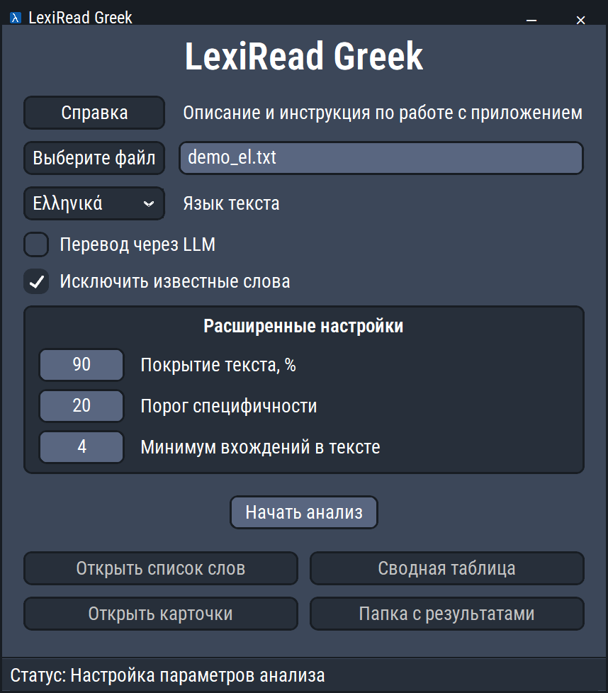

#  Word by Heart

> **Изменённая версия.** Это неофициальная модифицированная сборка проекта [WordByHeart](https://github.com/EgorTatarnikov/WordByHeart) (автор — Egor Tatarnikov), дополненная поддержкой греческого языка. Она не является официальным выпуском WordByHeart. Изменения: см. раздел «Греческий язык» ниже и историю ветки `greek`.

Приложение для подготовки к изучению лексики, необходимой для прочтения конкретной книги или просмотра сериала на иностранном языке.

В основе приложения лежит **NLP-pipeline**, который:

- анализирует текст: считает частоты, определяет леммы, части речи и грамматические признаки;
- выбирает ключевые слова: наиболее частые и специфичные для этого текста;
- дополняет лексику учебными грамматическими формами;
- строит IPA-транскрипцию;
- переводит слова с учётом конкретных предложений из книги;
- формирует таблицы и двусторонние карточки для изучения.

В результате **Word by Heart** превращает сырой текст в готовый набор слов для изучения и повторения.

Проект вырос из практической методики, где вместо абстрактной цели «выучить язык» ставится конкретная задача - прочитать книгу или посмотреть сериал.<br>
Изучение ограниченного набора слов, которые действительно важны для понимания выбранного текста, позволяет быстрее перейти к контенту на иностранном языке.<br>
Чтение любимых книг и просмотр сериалов в оригинале приносят удовольствие, дают ощущение прогресса и поддерживают мотивацию к дальнейшему изучению языка.

## Видеопрезентация

Youtube: [https://youtu.be/1IjTnEf85Ak?si=-1Oi9XMk0RGHBNNs](https://youtu.be/1IjTnEf85Ak?si=-1Oi9XMk0RGHBNNs)

## Скриншот приложения



## Языки
- Английский язык - поддерживается <br>
- Испанский язык - поддерживается в тестовом режиме
- Греческий (новогреческий) язык - поддерживается в тестовом режиме (добавлен в этой изменённой версии)

## Установка и запуск

1. Скачайте приложение. Для этого:
   - Вариант 1. Нажмите **Code** -> **Download ZIP**. Распакуйте архив в папку, где будет находиться приложение. 
   - Вариант 2. В папке, где будет находиться приложение, откройте терминал и выполните:
```bash
git clone https://github.com/EgorTatarnikov/WordByHeart.git
```

2. Запустите `INSTALL.bat`. По умолчанию устанавливаются приложение и компоненты английского языка.<br>
Список прямых Python-зависимостей и ограничения их версий указаны в `pyproject.toml`.

3. После успешной установки запустите `WordByHeart.bat`.

Испанский язык устанавливается отдельно. Выберите `Español` в приложении и нажмите «Установить испанский», либо запустите `INSTALL_SPANISH.bat`. 

Греческий язык устанавливается так же: выберите `Ελληνικά` и нажмите «Установить греческий», либо запустите `INSTALL_GREEK.bat`. Будут загружены модель spaCy `el_core_news_lg`, греческий раздел английского Викисловаря (Kaikki, около 220 МБ) и русский Викисловарь.


## Краткая инструкция по работе с приложением

1. Выберите txt-файл с текстом книги или субтитрами сериала (для тестового запуска уже выбран файл demo_en.txt).

2. Нажмите «Начать анализ».

3. Откройте «Список слов», «Карточки», «Сводную таблицу» и «Папку с результатами».
- **Список слов** – это слова, которые нужно выучить для комфортного чтения книги или просмотра сериала на иностранном языке.
- **Карточки** – это слова из списка, размещенные на листе в таблице 8х3. Один лист содержит 24 карточки. Файл подготовлен для двусторонней печати. Сначала распечатайте лицевые стороны всех листов, затем переверните бумагу и распечатайте обратные стороны. После разрезания получатся двусторонние карточки для изучения и повторения слов.
- **Сводная таблица** содержит леммы и словоформы, распознанные программой в тексте, а также их частоту, переводы, транскрипцию, грамматическую информацию и примечания. Она удобна для дополнительного анализа текста. 
- **В папке с результатами** хранятся все результирующие файлы.

## Подробная инструкция по работе с приложением

1. Выберите txt-файл с текстом на иностранном языке. Рекомендуется использовать кодировку UTF-8. Программа пытается автоматически распознать и прочитать другие распространённые кодировки, однако в некоторых случаях возможны ошибки. Если текст отображается неправильно, откройте файл в Блокноте, выберите «Сохранить как» и укажите кодировку UTF-8.

2. Выберите язык, на котором написан текст. Сейчас приложение поддерживает английский и испанский языки.

3. По умолчанию перевод слов выполняется через локальный словарь Kaikki. При необходимости можно включить перевод через языковую модель (LLM). Для этого потребуется API key OpenAI.

4. Если у вас имеются списки слов, которые вы уже знаете, перенесите их в словари (my_dictionary_en.xlsx – для английского, my_dictionary_es.xlsx – для испанского), которые находятся в корневой папке приложения. Для примера в словари уже внесено несколько слов. 
Если слово из вашего словаря будет найдено в книге, оно не будет переводиться и не будет включаться в итоговые списки и карточки слов для изучения. При этом такие слова останутся в сводной таблице.

5. Расширенные настройки. Установите ограничения для выбора слов параметрами «Покрытие текста», «Порог специфичности» и «Минимум вхождений в тексте».
По умолчанию заданы следующие параметры:
- **Покрытие текста** – 90%. В список для изучения войдут наиболее частые слова, которые суммарно покрывают 90% текста.
- **Порог специфичности** – 20. Дополнительно в список войдут слова, которые не входят в диапазон покрытия текста, но встречаются в тексте в 20 и более раз чаще, чем в среднем в других текстах. Удобный инструмент для быстрого погружения в предметные области, где встречается много специализированной лексики и терминов.
- **Минимум вхождений в тексте** – 4. Слово должно встретиться в тексте не менее четырёх раз, чтобы попасть в список для изучения, даже если оно соответствует настройкам покрытия или специфичности.

6. Нажмите «Начать анализ». Обработка текста зависит от его размера и выбранного способа перевода. При переводе через Kaikki она обычно занимает несколько минут. Перевод через LLM может занять существенно больше времени, особенно для большой книги.

7. Изучите результат анализа.

## Описание работы приложения

После выбора текста на иностранном языке программа выполняет обработку текста в несколько этапов.

**Предобработка.** Исходный текст загружается, очищается и подготавливается к анализу. Длинный текст разбивается на небольшие фрагменты (чанки), чтобы программа могла корректно обработать даже большую книгу.

**NLP-анализ.** Для проведения NLP-анализа используется модель spaCy. Она выделяет предложения, слова, начальные формы слов (леммы), части речи и грамматические признаки.

**Частотный анализ.** Программа собирает леммы, словоформы, примеры использования слов, подсчитывает частоту слов и их покрытие текста.

**Оценка специфичности.** Частота слова в данном тексте сравнивается с его обычной частотой в языке. В качестве источника общеязыковой частотности используется библиотека wordfreq, основанная на больших массивах текстов. Параметр «специфичность» показывает, насколько чаще слово встречается в этом тексте по сравнению с его обычной частотой в языке. Это помогает выделить слова, особенно важные для конкретного текста.

**Постобработка текста.** Программа очищает и объединяет результаты анализа, чтобы слова отображались в удобном для изучения виде. 

**Грамматическое дополнение.** Программа добавляет сведения, полезные для изучения слов. Для английского языка, к примеру, добавляются основные формы существительных и глаголов. Для этого используются данные spaCy, правила программы и словарь исключений.

**Транскрипция (IPA).** Для создания транскрипций используется eSpeak NG.

**Перевод.** Перевод слов по умолчанию выполняется через локальный словарь Kaikki. Имеется возможность подключить перевод через LLM. Для перевода используется OpenAI GPT-6 Luna. В модель передаётся не только слово, но и примеры его использования в тексте, часть речи и словоформы. Это позволяет переводить слова с учётом контекста.

**Валидация результата.** Программа проверяет результаты обработки и отмечает возможные проблемы. Например, если программа находит отсутствующий перевод или транскрипцию, сомнительную форму слова, неоднозначность или ошибку автоматического анализа, то такие слова попадают в отдельный список для проверки.

**Подготовка результатов.** Программа создаёт итоговые таблицы со словарём, переводами, транскрипцией и грамматической информацией, а также список слов и карточки для изучения.

## Греческий язык

Отличия обработки греческого текста:

- **Предобработка.** Файлы в старой кодировке читаются как Windows-1253. Политоническая орфография переводится в монотоническую, лишнее ударение перед энклитикой убирается (`η ένωσή του` → `ένωση`), однозначная элизия раскрывается (`σ'` → `σε`, `μ'` → `με`, `ν'` → `να`, `θ'` → `θα`, `γι'` → `για`, `απ'` → `από`), знак микро `µ` заменяется на `μ`. При приведении к нижнему регистру сохраняется конечная сигма (`λόγος`, а не `λόγοσ`).
- **Леммы.** Модель spaCy `el_core_news_lg` плохо лемматизирует глаголы (около 81% верных лемм на частых глаголах новостного текста). Поэтому леммы проверяются по словоформам греческого раздела Викисловаря (Kaikki): `ρώτησε` → `ρωτάω`, `είπε` → `λέω`. На том же тесте точность выросла до 99,7%. Слова, которых нет в словаре, сохраняют лемму spaCy и попадают в список для проверки.
- **Грамматика.** Для существительных показываются артикль, родительный падеж и множественное число (`ο δρόμος, του δρόμου, οι δρόμοι`), для прилагательных — три рода (`μεγάλος, μεγάλη, μεγάλο`), для глаголов — аорист (`γράφω, έγραψα`). Данные берутся из таблиц словоизменения Викисловаря.
- **Перевод.** Английские значения берутся из греческого раздела английского Викисловаря, русские — из таблиц переводов и греческих статей русского Викисловаря. Карточки показывают оба перевода.
- **Перевод через LLM.** Приложение умеет переводить через языковую модель (OpenAI) слова, которых нет в словаре; для греческого подготовлен отдельный промпт. В этой сборке перевод через LLM не используется: переводы берутся только из словарей Kaikki, а слова без перевода остаются с пометкой «—».
- **Транскрипция.** eSpeak NG (`el`). Сочетания с синизезой (`παιδιά`) eSpeak иногда транскрибирует слогово.

## Состав репозитория

В репозитории находятся исходный код WordByHeart, тесты, конфигурации, логотипы, шаблон карточек `table.docx`, исходные XLSX-словари, демо-тексты и два используемых интерфейсом начертания шрифта Roboto Condensed вместе с файлом OFL.

В репозиторий не входят устанавливаемые Python-библиотеки и модели, eSpeak NG, spaCy, Kaikki и wordfreq. Они устанавливаются после запуска `INSTALL.bat`.

## Лицензия

Лицензия представлена в файле [LICENSE](LICENSE). Источники загрузок и лицензии сторонних компонентов перечислены в [THIRD_PARTY_NOTICES.md](THIRD_PARTY_NOTICES.md).
